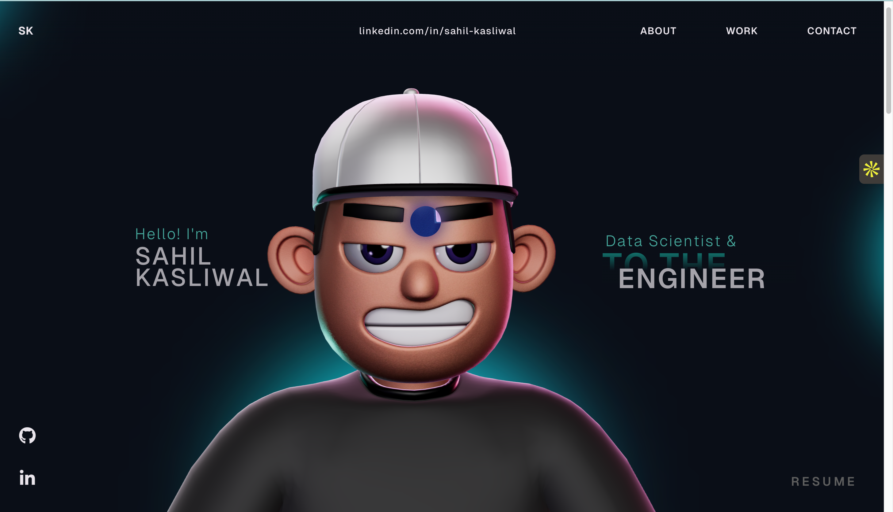

<div align="center">

# SAHIL KASLIWAL

### Data Scientist & AI Engineer

[](https://sahilk710.github.io/sahilk710/)
[](https://www.linkedin.com/in/sahil-kasliwal/)
[](https://github.com/sahilk710)
[](https://drive.google.com/file/d/1n3hE7rVhlM7N9Tlkt5w6YOyBXSEDdrth/view?usp=sharing)

---

*An immersive 3D portfolio featuring physics-based interactions, animated transitions, and a custom character scene — built to stand out.*

</div>

<br/>



---

## About Me

I am a **Data Scientist and AI Engineer** with hands-on expertise in LLMs, RAG pipelines, and knowledge-graph augmented solutions. I have a proven track record of building scalable AI/ML systems that optimize decision-making, reduce operational overhead, and deliver measurable business impact.

**Education:**
- **M.S. in Computer Software Engineering** (DS & ML Focus) — Northeastern University, Boston, MA | GPA: 3.7/4
- **B.Tech in Computer Science** — Medi-Caps University | GPA: 4/4

---

## What I Do

| AI & Data Science | Data Engineering |
|---|---|
| LLMs & Prompt Engineering | Python |
| RAG Pipelines | AWS SageMaker |
| Knowledge Graphs | SQL & dbt |
| NLP & BERT | Docker |
| Neo4j | Tableau |
| Snowflake | Streamlit & FastAPI |

---

## Featured Projects

### 01 — SkillMatchAI
> **AI-Powered Job Recommendation System**

An intelligent job matching platform that leverages semantic search to connect candidates with the most relevant opportunities.

**Tools:** OpenAI Embeddings, Pinecone, Airflow, FastAPI, Streamlit

[](https://github.com/sahilk710/jobzilla-ai)

---

### 02 — NVIDIA RAG Insights
> **RAG-Based Financial Analysis Platform**

A retrieval-augmented generation system for analyzing SEC financial filings with vector search and interactive dashboards.

**Tools:** RAG, Snowflake, Vector Search, dbt, Interactive Dashboards

[](https://github.com/sahilk710/Sec-Financial-Data-Pipeline)

---

### 03 — SummarAIze
> **PDF Summarization & QA AI**

An AI-powered document summarization and question-answering tool supporting multiple LLM backends with caching for performance.

**Tools:** GPT, Claude, LiteLLM, FastAPI, Redis, Streamlit

[](https://github.com/sahilk710/Customer-Support-Email-Agent)

---

### 04 — MarketMindAI
> **AI-Powered Market Intelligence**

An ML-driven market analysis platform that surfaces actionable insights from complex market data using NLP and visualization pipelines.

**Tools:** Python, NLP, ML Pipelines, Data Analytics, Visualization

[](https://github.com/sahilk710/MarketMindAI-)

---

## Career

| Role | Company | Period | Highlights |
|---|---|---|---|
| **Data Scientist** | Fidelity Investments, MA | 2025 | Led LLM prompt engineering across 5+ models, reduced hallucination by 34%, built RAG + Knowledge Graph QA platform improving multi-hop reasoning accuracy by 28% |
| **Data Scientist** | LMS Pvt Ltd | 2022–24 | Trained ML models on AWS SageMaker, built data pipelines processing 1TB+ data, achieved 85% accuracy on NLP sentiment analysis with BERT |
| **Data Engineer** | Codiant Software Technologies | 2020–22 | Automated analytics pipelines with Python/Docker/AWS, engineered Neo4j graph models across 1M+ transactions, 88% accuracy churn prediction leading to 23% churn reduction |

---

## Tech Stack

<div align="center">


</div>

---

## Portfolio Features

- **3D Character Scene** — Interactive Three.js character with mouse-tracking and scroll-driven animations
- **Physics-Based Tech Sphere** — Tech logos rendered as bouncing 3D spheres you can push around with your cursor
- **Smooth Scroll Storytelling** — GSAP ScrollSmoother + ScrollTrigger for cinematic section transitions
- **Custom Cursor** — Context-aware cursor that reacts to interactive elements
- **Interactive Project Carousel** — Swipeable project showcase with images and GitHub links
- **Fully Responsive** — Optimized layouts for desktop, tablet, and mobile

## Built With

```
React 18  ·  TypeScript  ·  Vite  ·  Three.js  ·  React Three Fiber  ·  GSAP  ·  Rapier Physics
```

## Quick Start

```bash
git clone https://github.com/sahilk710/sahilk710.git
cd sahilk710
npm install
npm run dev
```

## Deployment

Pushes to `main` auto-deploy to GitHub Pages via GitHub Actions.

---

<div align="center">

**Designed & Developed by Sahil Kasliwal**

&copy; 2026

</div>
